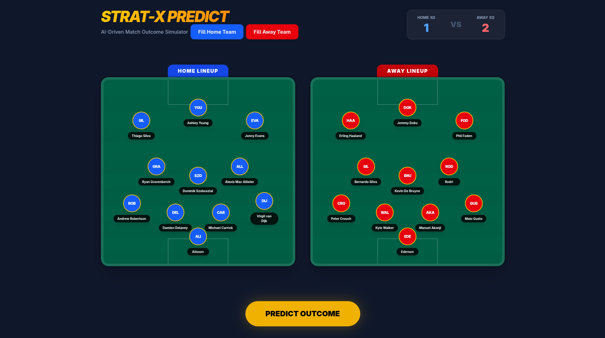

# ⚽ Player-Centric Match Predictor
**Moving beyond team history to model the impact of the starting XI.**

### 🔗 [Launch Live Simulator](https://ashilion.github.io/footplayer_stats_predictor/)

## 💡 The Core Concept
Traditional models look at "Team A vs. Team B." This model looks at **"These 11 players vs. Those 11 players."** By analyzing individual performance, we can predict outcomes based on:

* **Availability:** How much does losing a star playmaker actually drop the expected goals (xG)?
* **Current Form:** Is the defense currently over-performing their career averages?
* **Chemistry:** Do these specific center-backs play better when paired together?

## 🛠️ Data & Infrastructure
This project follows a modern MLOps architecture to ensure data stays fresh and the model remains scalable.

### 🔄 Automated Pipeline
* **Weekly Updates:** New player statistics and match results are scraped weekly.
* **Feature Store (Hopsworks):** Processed features are stored in **Hopsworks**, allowing for versioned data access and offline/online feature retrieval.
* **Backend:** A **FastAPI** service serves as the bridge between the React frontend and the model.
* **Deployment:** The backend is hosted on **Google Cloud Platform (GCP)** using Cloud Run for scalable, serverless execution.

## 🧠 Modeling Approach

### 1. The Current Engine
The model currently uses **XGBoost** to aggregate 22 individual profiles into a single match forecast. It processes:
* **Position-specific metrics:** xG for attackers, progressive passes for midfielders, xGA for defenders.
* **Rolling Form:** Recent performance trends that weight the "hot hand" more heavily than season averages.

### 2. Synergy & Sentiment (WIP)
* **Chemistry Score:** Calculated based on shared minutes and historical team success while specific pairings are on the pitch.
* **Public Sentiment:** A planned "Pressure Index" derived from social media to gauge player confidence.

## 🚀 Future Improvements: Player Embeddings
The next evolution of this model involves moving away from manual feature engineering toward **Deep Learning Embeddings**:

* **Latent Representations:** Using an Encoder-Decoder architecture to represent each player as a 32-dimensional vector. 
* **Tactical Style Encoding:** These embeddings will capture nuanced playing styles (e.g., "Ball-playing defender" vs. "No-nonsense stopper") that raw stats might miss.
* **Attention Mechanisms:** Implementing a Transformer-based architecture to learn non-linear interactions between players in a lineup (e.g., how a specific winger complements a specific striker).

> ### 🛡️ Disclaimer
> This project is for research and educational purposes only and is not intended for betting or gambling applications.